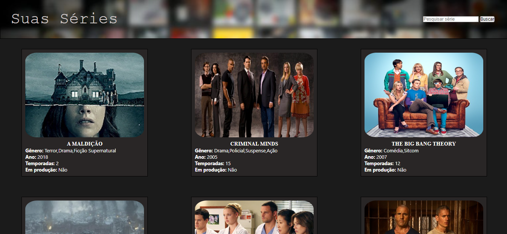

# Suas Séries

## 📄 Introdução

Este projeto foi desenvolvido utilizando HTML, CSS e Javascript com manipulação de DOM, sendo este responsivo (se ajustando a desktop, tablet e celulares). O objetivo é implementar uma página de busca de séries listadas, conforme o nome do titulo.

*Projeto elaborado durante o Bootcamp Web Full Stack Labenu no módulo Introdução a Web.

[Clique aqui para acessar o projeto]()

## 📄 Descrição
. Ao abrir a página, será carregado todas as séries armazenados em Objeto pelo JS. Você poderá fazer a busca do titulo desejado pelo nome, caso o titulo não exista, será exibido uma mensagem de erro. Caso você abra o Devtools, você conseguirá analisar as demais informações impressas dos titulos trabalhados dentro do Javascript.

## ⚒️ Tecnologias 

## 📫 Contato

E-mail: marianaceott@gmail.com

